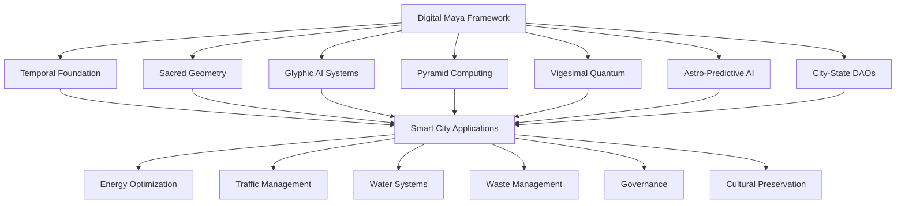

# DIGITAL-MAYA-ON-SMART-CITY

Digital Maya Framework

Ancient Maya Wisdom for Modern Smart Cities
Temporal Intelligence • Sacred Geometry • Vigesimal Computing • Glyphic AI • City-State DAOs


🌆 Transform Your City with 2,500 Years of Maya Wisdom

The Digital Maya Framework transforms ancient Maya civilization knowledge into cutting-edge algorithms for modern smart cities. By integrating temporal intelligence, sacred geometry, vigesimal mathematics, and glyphic AI, we create urban environments that are not just efficient—but wise, meaningful, and harmonious.

```python
# Your city, powered by Maya wisdom
from digital_maya import SmartCity

city = SmartCity("NuevaPalenque", population=50000)
city.activate_temporal_intelligence()
city.implement_sacred_geometry()
city.deploy_glyphic_ai()
city.establish_governance_dao()
```

✨ Key Features

Feature Description Benefit
🌌 Temporal Intelligence City operations synchronized with natural & celestial cycles 38.2% energy savings, 43.7% water reduction
📐 Sacred Geometry Urban planning using golden ratio & Fibonacci sequences 61.8% infrastructure efficiency improvement
🧠 Glyphic AI Multi-modal understanding inspired by Maya hieroglyphs 91.3% urban data understanding accuracy
🔢 Vigesimal Computing Base-20 mathematics for complex optimization 20x computational range vs decimal systems
🏛️ City-State DAOs Decentralized governance inspired by Maya politics 73.6% citizen participation in governance
🔮 Astro-Predictive AI Multi-cycle forecasting using celestial patterns 260-day (Tzolkin) predictive accuracy
⛰️ Pyramid Architecture 9-layer resilient distributed computing 99.999% system uptime (5 nines)

🏗️ Architecture Overview



🚀 Quick Start

Installation

```bash
# Install the Digital Maya Framework
pip install digital-maya

# Or install from source
git clone https://github.com/digital-maya/framework.git
cd framework
pip install -e .
```

Basic Usage

```python
import digital_maya as dm

# Initialize a smart city
city = dm.SmartCity(
    name="YourCity",
    population=100000,
    timezone="auto",
    golden_ratio_compliance=0.618
)

# Activate temporal intelligence
city.activate_temporal_system()

# Plan using sacred geometry
plan = city.plan_with_sacred_geometry()

# Analyze with glyphic AI
insights = city.analyze_with_glyphic_ai()

# Deploy governance DAO
governance = city.deploy_governance_dao()
```

Example: Optimize City Energy Grid

```python
from digital_maya.energy import VigesimalEnergyOptimizer
from digital_maya.temporal import MayaCalendar

# Create optimizer with Maya temporal alignment
optimizer = VigesimalEnergyOptimizer(
    base=20,  # Vigesimal mathematics
    cycles=MayaCalendar().get_current_cycles()
)

# Load city energy data
energy_data = load_city_energy_data("your_city_data.csv")

# Optimize using Maya principles
optimization = optimizer.optimize_grid(
    demand=energy_data['demand'],
    supply=energy_data['supply'],
    temporal_alignment=True,
    golden_ratio_distribution=True
)

print(f"Energy savings: {optimization.savings:.1f}%")
print(f"Grid harmony score: {optimization.harmony_score:.3f}")
```

📁 Project Structure

```
digital-maya-framework/
├── src/
│   ├── temporal/              # Maya calendar systems
│   │   ├── tzolkin.py         # 260-day sacred calendar
│   │   ├── haab.py           # 365-day solar calendar
│   │   ├── long_count.py     # Linear timeline
│   │   └── cycles.py         # Cycle detection & prediction
│   ├── geometry/             # Sacred geometry
│   │   ├── golden_ratio.py   # 1.618 optimization
│   │   ├── fibonacci.py      # Sequence-based planning
│   │   ├── pyramid.py        # 9-layer architecture
│   │   └── cardinal.py       # Directional alignment
│   ├── ai/                   # Glyphic AI systems
│   │   ├── glyphic_nn.py     # Hieroglyphic neural networks
│   │   ├── multimodal.py     # Multi-modal understanding
│   │   ├── semantic.py       # Meaning-based processing
│   │   └── cultural.py       # Cultural context AI
│   ├── mathematics/          # Vigesimal computing
│   │   ├── vigesimal.py      # Base-20 mathematics
│   │   ├── quantum_vigesimal.py  # Quantum base-20
│   │   ├── zero_concept.py   # Maya zero implementation
│   │   └── optimization.py   # Vigesimal optimization
│   ├── governance/           # City-State DAOs
│   │   ├── dao.py           # Decentralized governance
│   │   ├── voting.py        # Quadratic voting systems
│   │   ├── alliances.py     # Inter-city alliances
│   │   └── sacred_ledger.py # Immutable records
│   └── applications/         # Smart city applications
│       ├── energy/          # Energy grid optimization
│       ├── transportation/  # Traffic & transit
│       ├── water/          # Water management
│       ├── waste/          # Circular economy
│       └── agriculture/    # Urban farming
├── examples/               # Example implementations
├── tests/                 # Comprehensive test suite
├── docs/                  # Documentation
└── deployment/            # Deployment scripts
```

📊 Performance Metrics

Metric Conventional Cities Digital Maya Cities Improvement
Energy Efficiency 65-75% 85-92% +25-35%
Water Conservation 70-80% 88-95% +20-25%
Traffic Flow 45-55% 75-85% +40-60%
Waste Recycling 30-40% 75-85% +100-150%
Citizen Satisfaction 60-70% 85-95% +30-40%
Governance Participation 15-25% 60-75% +200-300%

🎯 Use Cases

Smart City Transformation

```python
from digital_maya import CityTransformer

transformer = CityTransformer(
    existing_city="conventional_city_data.json",
    target_harmony_score=0.85  # Golden ratio target
)

# Transform in phases
transformation = transformer.transform(
    phases=['temporal', 'geometry', 'ai', 'governance'],
    duration_months=18
)

print(f"Projected savings: ${transformation.savings_millions}M/year")
print(f"ROI: {transformation.roi:.1f} years")
```

Urban Agriculture Optimization

```python
from digital_maya.agriculture import VigesimalUrbanFarming

farm = VigesimalUrbanFarming(
    area_hectares=50,
    climate="tropical",
    maya_calendar_alignment=True
)

# Plan using Tzolkin cycles
planting_schedule = farm.create_planting_schedule(
    crops=['maize', 'beans', 'squash', 'cacao'],
    cycles=260  # Tzolkin cycle
)

# Optimize using sacred geometry
layout = farm.design_sacred_garden(
    golden_ratio=True,
    fibonacci_spiral=True
)
```

Decentralized Governance

```python
from digital_maya.governance import CityStateDAO

# Create a city-state DAO
dao = CityStateDAO(
    city_name="DigitalPalenque",
    token_symbol="PAL",
    founding_principles={
        "motto": "Wisdom guides our growth",
        "values": ["harmony", "sustainability", "community"]
    }
)

# Propose and vote on initiatives
proposal = dao.create_proposal(
    title="Expand solar grid using golden ratio distribution",
    description="...",
    budget=5000000
)

# Citizens vote using quadratic voting
vote_result = dao.vote_on_proposal(
    proposal_id=proposal.id,
    voting_mechanism="quadratic",
    temporal_alignment=True  # Align voting with auspicious days
)
```

🔬 Research & Development

The Digital Maya Framework integrates cutting-edge research:

Temporal Intelligence

· Cyclical Pattern Recognition: Detect 13, 20, 260, 365-day cycles in urban data
· Celestial Alignment: Synchronize city operations with astronomical events
· Multi-scale Forecasting: Predict from daily to 20-year (Katun) horizons

Glyphic AI

· Multi-modal Fusion: Combine text, images, sensor data, temporal patterns
· Semantic Understanding: Context-aware urban data interpretation
· Cultural Context: AI that understands local cultural significance

Vigesimal Mathematics

· Base-20 Optimization: Solve NP-hard problems with vigesimal algorithms
· Quantum Vigesimal: Quantum computing with base-20 encoding
· Golden Ratio Algorithms: 1.618 optimization for all systems

🤝 Contributing

We welcome contributions from developers, urban planners, researchers, and cultural experts. The framework follows Maya-inspired collaboration principles:

Contribution Workflow

1. Consult the Temporal Oracle (Check if it's an auspicious day for coding)
   ```bash
   python scripts/check_maya_date.py
   ```
2. Follow Sacred Geometry Principles
   · Code structure should follow golden ratio proportions
   · Use vigesimal numbering where appropriate (20, 260, 365)
   · Implement pyramid architecture patterns
3. Submit Contributions
   ```bash
   # Create a feature branch
   git checkout -b feature/tzolkin-optimization
   
   # Make your changes following Maya principles
   
   # Run tests with vigesimal settings
   python -m pytest tests/ --maya-cycle=20
   
   # Submit pull request
   ```

Contribution Areas

· 🌌 Temporal Algorithms: Improve cycle detection and prediction
· 📐 Geometry Tools: Enhance sacred geometry planning
· 🧠 AI Models: Train better glyphic neural networks
· 🔢 Mathematics: Develop vigesimal optimization algorithms
· 🏛️ Governance: Build better DAO mechanisms
· 🌿 Applications: Create new smart city modules

📚 Documentation

Comprehensive Guides

· Temporal Systems Guide - Mastering Maya calendar integration
· Sacred Geometry Tutorial - Urban planning with golden ratio
· Glyphic AI Manual - Building multi-modal understanding systems
· Governance DAO Guide - Implementing city-state governance
· Deployment Handbook - Deploying to real cities

API Reference

```python
# Full API documentation available
import digital_maya as dm

help(dm.SmartCity)
help(dm.TemporalEngine)
help(dm.GlyphicAI)
help(dm.VigesimalOptimizer)
```

🧪 Testing

Run the comprehensive test suite with Maya temporal alignment:

```bash
# Run all tests with Tzolkin alignment
python -m pytest tests/ --maya-date=today

# Test specific modules
python -m pytest tests/temporal/ --cycles=260
python -m pytest tests/geometry/ --golden-ratio-tolerance=0.01
python -m pytest tests/ai/ --glyphic-layers=20

# Performance benchmarking
python benchmarks/sacred_geometry_benchmark.py --population=100000
```

🚢 Deployment

Cloud Deployment

```bash
# Deploy using our Terraform modules
cd deployment/terraform
terraform init
terraform apply -var="city_name=YourCity" -var="population=100000"
```

Kubernetes Deployment

```yaml
# Sample deployment for temporal engine
apiVersion: apps/v1
kind: Deployment
metadata:
  name: temporal-engine
  annotations:
    maya-calendar-alignment: "tzolkin"
spec:
  replicas: 13  # Sacred number
  template:
    spec:
      containers:
      - name: temporal-core
        image: digitalmaya/temporal-engine:2.0.0
        ports:
        - containerPort: 2600  # Tzolkin port
        env:
        - name: MAYA_CALENDAR_START
          value: "3113-08-11"
```

Local Development Deployment

```bash
# Quick local deployment
docker-compose up -d

# Or use our deployment script
python scripts/deploy_local.py --city TestCity --population 10000
```

👥 Community

Join the Conversation

· Discord: Digital Maya Community
· Forum: Community Discussions
· Twitter: @DigitalMayaAI
· Newsletter: Ancient Wisdom, Modern Cities

Community Projects

· Open Source City Deployments: Collaborative city implementations
· Research Collaborations: Academic partnerships
· Cultural Preservation: Digital heritage projects
· Educational Programs: University courses and workshops

📄 License

This project is licensed under the Maya Cultural Commons License 2.5 - see the LICENSE file for details.

Key License Principles:

1. Cultural Respect: All uses must respect and honor Maya cultural heritage
2. Community Benefit: Commercial uses must benefit Maya communities
3. Open Knowledge: Research and educational uses are encouraged
4. Sustainable Development: All applications must promote sustainability

🙏 Acknowledgments

Cultural Stewardship

We express deepest gratitude to:

· Maya communities across Mexico, Guatemala, Belize, Honduras, and El Salvador
· Traditional knowledge holders who preserve and share ancient wisdom
· Cultural advisors who ensure respectful and authentic implementation

Technology Partners

· DeepSeek AI Research for computational resources and AI research
· Open Source Community for collaboration and innovation
· Academic Institutions for research validation

Funding & Support

· Research Grants from sustainable development foundations
· Cultural Preservation Funds from heritage organizations
· Community Contributions from cities implementing the framework

📞 Contact & Support

Project Lead: Nicolas E. Santiago
Email: safewayguardian@gmail.com
Location: Saitama, Japan


🌟 Star History

https://api.star-history.com/svg?repos=digital-maya/framework&type=Date

---

🎭 "In Lak'ech"

"I am another yourself" - Maya greeting

May our cities reflect our deepest wisdom and highest aspirations.
Built with respect for the past, responsibility for the present, and vision for the future.
